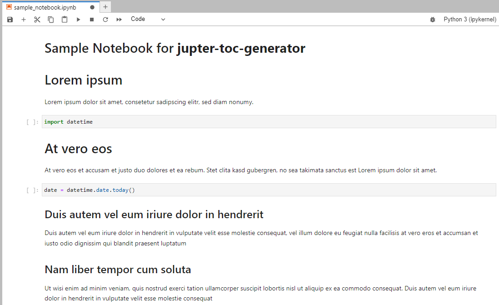
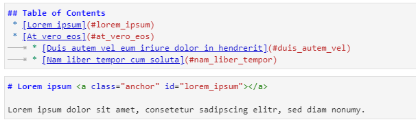

# jupyter-toc-generator
Generate a table of contents incl. links and anchor tags. Writes directly to the Jupyter Notebook. 
Alternatively, copy the generated table of contents to clipboard.

* No third party dependencies except Pyperclip if using --clipboard option.
* Requires Python 3.7 or higher. Therefore, compatible with AWS Sagemaker.


## Usage
```
    python generate_toc /home/user/notebook.ipynb [options]
    python generate_toc "C:\My Files\My Notebook.ipynb" [options]
    python generate_toc --help
```

## Options

| Parameter                      | Mandatory | Description                                                                                | Example                   |
|:-------------------------------|:----------|:-------------------------------------------------------------------------------------------|:--------------------------|
|                                | x         | Path to Jupyter notebook (relative or absolute)                                            | /home/user/notebook.ipynp |
| --log_level (-l)               |           | Set Log level (DEBUG, INFO, WARNING, ERROR, CRITICAL). Default: INFO.                      | -l DEBUG                  |
| --skip_anchor_tags (-sa)       |           | Don't add anchor tags to header cells if missing.                                          | -sa                       |
| --skip_write_toc (-sw)         |           | Don't Update TOC directly in notebook or insert if missing.                                | -sw                       |
| --force_toc_in_first_cell (-f) |           | If inserting missing TOC, don't skip overall title cell but always insert into first cell. | -f                        |
| --clipboard (-c)               |           | Copy generated TOC to clipboard.                                                           | -c                        |

## Screenshots
### Notebook before


### Notebook after TOC generation


### Generated Markdown Code for TOC and anchor tags added to headers
